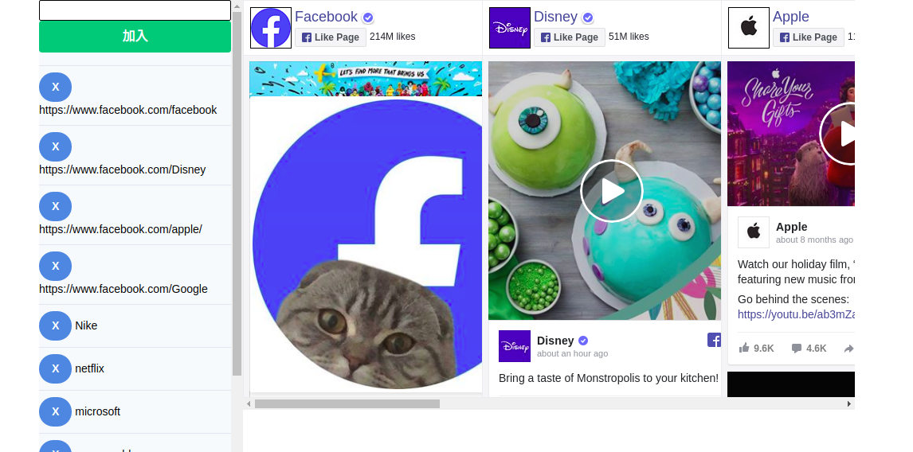

# Monfeed - all-in-one page for Facebook Page Feed

_last update: 2019-07-08_

To have a glance of selected pages feed in one page. You would not miss any posts of the page.

live demo: [https://oktak.github.io/monfeed/](https://oktak.github.io/monfeed/)

It uses `localStorage` HTML5 technology in browsers to retain the users\' preferences. And it uses `Social Plugin` of Facebook to show the feeds.

## Get Started

1. Type url or page ID to text box on top left corner, then click `'加入'` to insert to the list. The page feed would be loaded automatically.

2. You may click `'X'` button to remove the correspondant item.

3. Click `'預設值'` to restore to the default list. **All your preferences will be Cleared!**

## Precaution

- This web page supports mobile responsive.
- It is memory intense.
- It is suggested to use under WiFi connection.
- Some browsers, e.g. `Firefox`, it may block Facebook Social Plugin, which is treated as tracking contents. You may need to disable the blocking manually.

Mobile Version

## To Contribute
- Please feel free to make pull requests.
- If you find any bugs or have any enhancement/feature, please add new issues.
